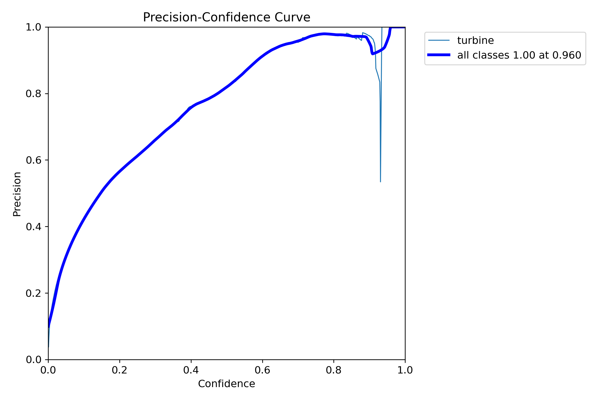

# wind turbine detection
## OverView:
>A **Wind Turbine Detection** project aims to identify and locate wind turbines within a given area. This involves using various techniques such as computer vision, image processing, and machine learning algorithms to analyze satellite images or other types of imagery.
>The primary goal of this project is to accurately detect the location of wind turbines in order to improve renewable energy planning and management. This information can be used to optimize wind farm layouts, monitor wind turbine performance, and assess the potential for new wind energy projects.

## Installation:
In order to run the project and use it you to run the following commands:

* Install all the requirements
```
pip install -r requirements.txt
```
```
git clone https://github.com/ultralytics/yolov5
```
```
pip install -q -U pycocotools
```

## Usage:
1. To use the Turbiness detection :
```
python app.py
```
a window will pop up and the camera will launch and the model will detect any torbines on the frame.

If you want to detect only image run:
```
python detect_app.py
```
you should spacify the image path ,the python script will export the detected image on img.jpg

2. To Traine the model and play around with the project :

run the following command:
```
jupyter notebook
``` 
You need to downlaod the dataset on [kaggle](https://www.kaggle.com/datasets/kylegraupe/wind-turbine-image-dataset-for-computer-vision) .

**Note**:Just run the cells ,you don't need to install the dataset manual.

## Dataset:
The dataset used ,was collected on [kaggle.com](kaggle.com/datasets/kylegraupe/wind-turbine-image-dataset-for-computer-vision).

This dataset contains images of wind turbines in dynamic and changing backgrounds

## Methodology:

**Training**:

We used the YOLOv5 algorithm to train a custom object detection model on the annotated images. We trained the model using transfer learning, initializing the weights with the pre-trained YOLOv5 weights. We fine-tuned the model using our annotated wind turbine dataset and trained it for 5 epochs.


**Evaluation**:

We evaluated the performance of the model on the validation set using mAP (mean average precision) as the evaluation metric. The model achieved a precision of `0.7`, indicating a high level of accuracy in wind turbine detection.





**Inference**:

We used the trained YOLOv5 model to perform wind turbine detection on new satellite images. The model was able to accurately detect wind turbines in the images, and we visualized the detection results using bounding boxes around each wind turbine.

Overall, we found that YOLOv5 is an effective algorithm for wind turbine detection in satellite images, achieving high accuracy and robust performance on our annotated dataset.


## Conclusion:

 The system uses YOLOv5, a state-of-the-art object detection algorithm, to accurately identify wind turbines in images. This has the potential to greatly assist in the maintenance and monitoring of wind farms, allowing for the detection of faulty turbines or other issues that may require attention. Additionally, this technology can help improve the safety and efficiency of wind farm operations.

Overall, the project highlights the importance of using advanced technologies to address real-world challenges in the renewable energy sector. It is a great example of how machine learning and computer vision can be applied to make a positive impact on our environment and society.

## License:
This project is open source and available for anyone to use. You are free to modify and distribute this code as you see fit.
